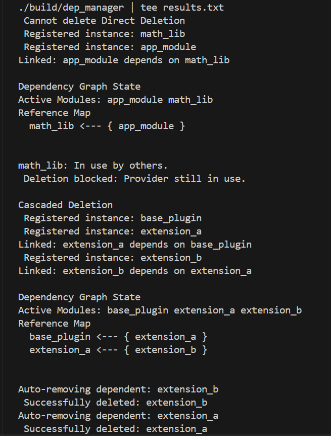

# LFX Mentorship 2026 (Term 1): Module Instance Dependency Tree in WASM Store


##  Project Overview

**Project:** Module instance dependency tree in WASM store  
**Organization:** WasmEdge Runtime  
**Issue:** [#4514](https://github.com/WasmEdge/WasmEdge/issues/4514)  

### The Problem
In the WasmEdge runtime, module instances are stored and managed dynamically. A critical issue arises when a module instance (let's call it `Module B`) is deleted while another module (`Module A`) still imports and relies on it.

Currently, the store allows `Module B` to be deleted without checking for active dependents. This leads to **dangling pointers** and **segmentation faults (crashes)** when `Module A` subsequently tries to access the deleted memory.

### The Solution
This project implements a **Module Instance Dependency Tree** within the `Store` class. This system tracks relationships between modules (Who imports whom?) and enforces memory safety during deletion.

The solution introduces two modes of deletion:
1.  **Strict Mode:** Prevents deletion if *any* other module depends on the target.
2.  **Cascading Mode:** Automatically identifies and removes the entire tree of dependent modules in a safe, bottom-up order.

---
## 🚀 Running the Examples

I have created a demonstration file `main.cpp` that simulates the Store environment to showcase the two deletion strategies.

### 1. Code Example (`main.cpp`)

This code demonstrates a "Diamond Dependency" scenario:
* **Module A (Provider):** The base module.
* **Module B (Consumer):** Imports Module A.
* **Module C (Consumer):** Imports Module A.
* **Module D (Top-Level):** Imports Module B.

```cpp
#include <iostream>
#include "store_manager.h"

int main() {
    StoreManager store;

    // 1. Register Modules (Simulating the dependency graph)
    // Graph: D -> B -> A <- C
    auto idA = store.registerModule("Module_A", {});           // No imports
    auto idB = store.registerModule("Module_B", {"Module_A"}); // Imports A
    auto idC = store.registerModule("Module_C", {"Module_A"}); // Imports A
    auto idD = store.registerModule("Module_D", {"Module_B"}); // Imports B

    // Try to delete Module A. It should fail because B and C depend on it.
    auto result = store.removeModule(idA, false); // false = Strict Mode
    if (result == ErrCode::ModuleInUse) {
        std::cout << "Strict Mode prevented unsafe deletion of Module A.\n";
    } else {
        std::cout << "Fail\n";
    }

    // Try to delete Module B. 
    // Cascade should remove: Module D (dependent) -> Module B (target).
    // Note: Module A remains untouched because B depended on A, not the other way around.
    store.removeModule(idB, true); // true = Cascading Mode
    
    // Verify D is gone
    if (!store.findModule(idD)) {
        std::cout << "removed dependent Module D.\n";
    }
    // Verify B is gone
    if (!store.findModule(idB)) {
        std::cout << " removed target Module B.\n";
    }

    return 0;
}
```

##  Technical Implementation

The implementation works by maintaining a Directed Acyclic Graph (DAG) of module dependencies. The lifecycle is managed in five phases:

### Phase 1: Dependency Graph Construction (Linking)
When a new module is registered via `registerModule`, the system inspects its imports.
- **ModDepMap (Forward Edge):** Records what the new module needs.
- **ModRefMap (Reverse Edge):** Records that existing modules are now "in use" by the new module.

### Phase 2: Deletion Routing
The `removeModule` API acts as a router based on user intent:
- If `cascade = false`: Routes to **Strict Mode**.
- If `cascade = true`: Routes to **Cascading Mode**.

### Phase 3: Safe Order Calculation (Cascading Only)
If cascading is selected, a Depth-First Search (DFS) is performed to collect all dependents. A **Post-Order Traversal** ensures "children" (dependent modules) are scheduled for deletion *before* their "parents" (dependencies).

### Phase 4: Safety Verification (The Guard)
Before deletion, `removeModuleStrict` checks the `ModRefMap`.
- If the module has incoming edges (active dependents), it returns `ErrCode::ModuleInUse`.

### Phase 5: Unlink and Memory Reclamation
Finally, `unlinkModules` removes the edges from the graph, and `Modules.erase` frees the memory safely.

---

## Building and Testing

### Prerequisites
- C++ Compiler (GCC/Clang) supporting C++17 or later
- CMake 3.12+
- WasmEdge dependencies (LLVM)
